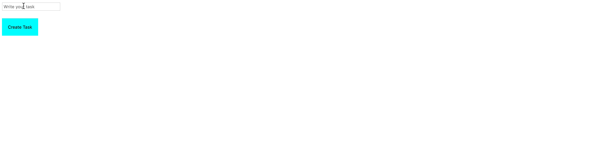

# To-Do List App

1. Create a TO-DO List app with an input field and button for adding To-Do's. On **Submit** or **Button-click**, a To-Do should be added to the list of To-Do's.

1. Add a _Delete_ button in the form of **X**, to enable the user delete a To-Do from the list.

1. **Optional:** Style to your pleasing.

> Hint: Refer to the representation below, for an idea of what your result should look like.

